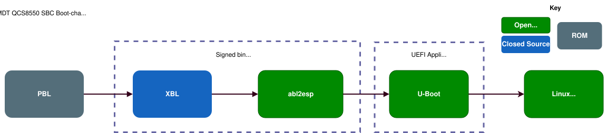

# meta-imdt-qcom-oss - Getting Started Guide 

[](https://github.com/imd-tec/meta-imdt-qcom-oss-dev/actions/workflows/build-imdt-base-image.yml)
[](https://github.com/imd-tec/meta-imdt-qcom-oss-dev/actions/workflows/build-imdt-base-image.yml)
[](https://github.com/imd-tec/meta-imdt-qcom-oss-dev/actions/workflows/build-imdt-base-image.yml)


The role of this meta layer is the following:
  - Provide an open source friendly BSP for IMDT Qualcomm boards
  - No qualcomm login needed
  - Track master branch Yocto/OpenEmbedded and [meta-qcom](https://github.com/qualcomm-linux/meta-qcom)
  - Track upstream Linux and U-Boot
  - Easy-to-use kas based build process 

The images are built on top of the [meta-qcom-distro](https://github.com/qualcomm-linux/meta-qcom-distro) distribution.

## Table of Contents

- [QCS8550-SBC Feature Support](#qcs8550-sbc-feature-support)
- [Upstreaming Status](#upstreaming-status)
- [Boot Chain](#boot-chain)
- [References](#references)
- [Downloading prebuilt release images](#downloading-prebuilt-release-images)
- [Prerequisites](#prerequisites)
- [Building release images](#building-release-images)
- [Deploying images](#deploying-images)
- [Working with the board](#working-with-the-board)
- [SWUpdate](#swupdate)
- [Appendix](#appendix)

## QCS8550-SBC Feature Support

| Feature | Hardware | Interface | Kernel Driver | Status |
|---|---|---|---|---|
| A/B Rootfs Updates | — | — | — | ✅ |
| ADSP | Hexagon v73 DSP | — | remoteproc | ✅  |
| Android Debug Bridge (ADB) | — | USB | — | ✅ |
| Audio (LPASS) | — | — | — | ❌ |
| Bluetooth | NXP IW416 | UART14 | btnxpuart | ✅ |
| Camera (AR1335 - 13MP) | ON Semiconductor AR1335 | CSI0 | ar1335 | ✅ |
| CDSP | Hexagon v73 DSP | — | remoteproc | ✅ |
| Debug Serial Console (J19)| — | UART7 (115200 baud) | qcom-geni-serial | ✅ |
| DDR Memory | 8GB / 12GB LPDDR5 | — | — | ✅ 8GB and 12GB boards supported |
| Gigabit Ethernet | Microchip LAN7430 | PCIe1 (default) | lan743x | ✅ |
| PCIe Expansion (M.2 Key-B) | PCIe switch downstream Key-B port | PCIe1 (overlay) | qcom-pcie | ✅ Requires Key-B DTBO overlay |
| GPIO | PM8550 GPIO bank | SPMI | qcom-spmi-gpio | ✅ |
| GPU (Adreno 740) | Adreno 740 | — | msm drm | ✅ |
| I2C | QupV3 I2C hub | I2C | geni-i2c | ✅ |
| IPA | Qualcomm IP Accelerator | — | ipa | ✅ |
| ISP (CAMX) | Qualcomm proprietary camera framework | — | — | ❌ |
| libcamera (AR1335) | ON Semiconductor AR1335 | CSI0 | ar1335 | ✅ |
| libcamera tuning (AR1335) | ON Semiconductor AR1335 | CSI0 | ar1335 | 🚧 WiP |
| microSD Card | — | SDHC2 | sdhci | ✅ |
| MIPI DSI Display | Team Source TST070WSBE-196C 7" | DSI0 | drm/msm | ✅ |
| OTA Rootfs Updates | — | — | — | ✅ |
| PCIe Expansion (M.2 Key-E) | M.2 Key-E slot | PCIe0 | qcom-pcie | ✅ |
| U-Boot as ARM64 UEFI App| — | — | — | ✅ |
| UFS Storage | — | UFS | ufshcd | ✅ |
| USB 3.0 Type-C | NXP PTN3222 eUSB2 redriver | DWC3 (QCOM) | dwc3-qcom | ✅ Peripheral mode |
| Wi-Fi 802.11a/b/g/n/ac | NXP IW416 | SDIO (SDHC4) | mwifiex_sdio | ✅ |
| Yocto / OpenEmbedded Master branch | — | — | — | ✅ |


## Upstreaming Status
An effort is being made into upstreaming our board and patches into Linux.
| Patch | Status | Upstream Thread |
|---|---|---|
| Team Source TST070WSBE-196C display panel | ✅ Accepted | [v2 on lore.kernel.org](https://lore.kernel.org/all/20260428-imdt-dsi-display-v2-0-cf7294b5d7d6@imd-tec.com/T/#t) |
| SDHC4 (Wi-Fi SDIO) support | Pending | [v2 on lore.kernel.org](https://lore.kernel.org/all/20260427-sm8550-sdhc4-support-v2-1-a4241f43ecd5@imd-tec.com/T/#u) |
| QCS8550 SBC device tree | WiP | [v4 on lore.kernel.org](https://lore.kernel.org/linux-arm-msm/20260610-imdt-qcs8550-sbc-rfc-v4-0-358e71d606bc@imd-tec.com/T/#u) |
| AR1335 camera sensor | Planned | — |

## Boot Chain

The boot chain used to boot into Linux is shown below.


1. **PBL** (Primary Boot Loader) — BootROM that loads the next stage (XBL) from UFS.
2. **XBL** (eXtensible Boot Loader) — Qualcomm firmware that initialises DDR, the PMIC and clocks, and sets up the early boot environment. The XBL is also responsible for implementing UEFI.
3. **abl2esp** — our open source stand-in for Qualcomm's ABL (Application Boot Loader). It's a signed binary that transitions from bare metal into a UEFI app located within the EFI partition.
4. **U-Boot** — built as an ARM64 **UEFI application** (`BOOTAA64.EFI`) on the EFI System Partition (ESP), which is what `abl2esp` finds and starts. Running U-Boot here lets us apply device tree fixups/overlays and select the A/B rootfs slot (with automatic rollback) before booting Linux.
5. **Linux** — U-Boot loads the kernel and matching device tree and boots into the Yocto userspace.

## Hardware Testing

Every commit is automatically tested on a physical IMDT 8550 SBC via [LAVA](https://lava.readthedocs.io/). Both the `qcom-minimal-image` and `qcom-multimedia-image` builds are deployed and tested in turn. Each run executes these jobs in sequence:

1. **SWUpdate deploy** — flashes the image under test over ADB and verifies the A/B rootfs slot switches
2. **System tests** — checks kernel health, systemd state, hardware subsystems (GPU, BT, RTC, IOMMU, I2C, hwrng), Wi-Fi, camera streaming, and SD card over SSH
3. **AR1335 frame capture** — captures a raw frame from the CSI0 camera and de-mosaics it to a 1080p PNG

See [docs/lava-tests.md](docs/lava-tests.md) for the full list of test cases.

## References

[1] [IMDT - QCS8550 SBC Datasheet rev 1.2](https://132746293-files.gitbook.io/~/files/v0/b/gitbook-x-prod.appspot.com/o/spaces%2FZvb1NVc2NQ09Xi4V8tb6%2Fuploads%2F4MwJ4jR2lujBBEVCaqCn%2FIMDT%20-%20QCS8550%20SBC%20Datasheet%20ver%201.2.pdf?alt=media&token=5371ed60-a7dd-4a76-92ca-22f02fe01d8b)

## Downloading prebuilt release images

If you don't need to build from source, every tagged release publishes the full
set of deploy images as a single compressed tarball on the
[GitHub Releases page](https://github.com/imd-tec/meta-imdt-qcom-oss-dev/releases).

Because the tarball is larger than GitHub's 2 GiB per-file limit, it is split
into numbered parts (`qcom-imdt-images.tar.zst.part00`, `.part01`, …). 
The snippet below pulls the latest release, stitches
the parts back together, verifies the checksum and extracts everything into
`./images`:

```bash
base="https://github.com/imd-tec/meta-imdt-qcom-oss/releases/latest/download"
name="qcom-imdt-images.tar.zst"

# Download the parts (this release has three) plus the checksum.
wget "$base/$name.part00" "$base/$name.part01" "$base/$name.part02" "$base/$name.sha256"

# Reassemble, verify and extract into ./images (needs zstd installed).
cat "$name".part* > "$name"
sha256sum -c "$name.sha256"
mkdir -p images
tar --zstd -xf "$name" -C images
```

> The release notes list how many parts a given release has — add or remove
> `.partNN` arguments to match if it isn't three.

To grab a specific release instead of the latest, replace `latest/download`
with `download/<tag>` (e.g. `download/v1.2.3`).

You can then flash the extracted images with [QDL](#qdl) or push the `.swu`
package with [SWUpdate](#swupdate).

## Prerequisites

This process has been tested on machines with the following parameters:

- Ubuntu 22.04
- Docker Engine v24.02
- 8 Core / 16 Threads Processor
- 64GiB RAM
- At least 500GB of disk space on an ext4 formatted drive
- Python3 installed

It's recommended that anything older than Ubuntu 22.04 isn't used due to quirks with Docker security.

## Building release images

This section describes the process for building the release images from source.

### Prerequisites

This needs to be performed once on your machine:

```bash
git clone https://github.com/imd-tec/meta-imdt-qcom-oss.git
python3 -m venv venv
. venv/bin/activate
pip3 install kas
```

Once this has been completed, you can then restore the python environment using:

```bash
. venv/bin/activate
```

### Building

To build a bleeding edge image which tracks the master branch of all meta layers:

```bash
# Minimal image
kas-container build --update meta-imdt-qcom-oss/kas/imdt-8550-minimal.yml

# Multimedia image (adds Weston + GStreamer media stack)
kas-container build --update meta-imdt-qcom-oss/kas/imdt-8550-multimedia.yml

# Both images in a single build (shares the common package set; used by CI)
kas-container build --update meta-imdt-qcom-oss/kas/imdt-8550-all.yml
```

Bleeding edge builds can fail from time-to-time. If you wish to build a known working Kas configuration you can use the below command:

```bash
wget https://github.com/imd-tec/meta-imdt-qcom-oss/releases/latest/download/qcom-imdt-images-kas-dump.yml
kas-container build qcom-imdt-images-kas-dump.yml
```

### Disabling Modem Manager

This may not be necessary if the host machine does not have the ModemManager service running. This is to stop the ModemManager configuring the Qualcomm device as a modem, if it sees the Qualcomm device as a modem.

```bash
sudo systemctl stop ModemManager.service
```

### Boot SBC into Emergency Download (EDL) mode

To boot the SBC into EDL mode, do the following:

1. Power on the board via the DC Jack or the USB PD port
2. Press and hold the USB BOOT button
3. Press the Reset button for 1-2 seconds whilst the USB BOOT button is held
4. For some boards you may also need to press the PON key
5. Release the USB BOOT button

Refer to [Connectors - Top Side](#11-connectors---top-side) to see the location of the USB BOOT and Reset buttons.

## Deploying images

It's recommended to use a Linux host for deploying images as QDL is complicated to build for Windows and instructions aren't going to be provided by IMDT.

### QDL

QDL can be used as a replacement for PCAT for customers without access to Qualcomm tools.

#### Building QDL

Run these commands on your host machine outside of Docker:

```bash
sudo apt install libxml2-dev libusb-1.0-0-dev help2man
git clone https://github.com/danielkutik/qdl.git 
cd qdl
make
sudo make install
```

#### QDL bash function 

Append the below bash function to your `.bashrc` file:

```bash
flash_qcs8550_sbc() {
    local image="${1:?Usage: flash_qcs8550_sbc <image-name>}"
    local dir="${image}-imdt-8550-sbc.rootfs.qcomflash"
    qdl -i "${dir}/" xbl_s_devprg_ns.melf "${dir}/rawprogram"*.xml "${dir}/patch"*.xml
}
```

#### Flashing an image

Please make sure that the board is powered and in EDL as per [these instructions](#boot-sbc-into-emergency-download-edl-mode).

After unzipping a prebuilt image or an image you have built yourself, pass the image name as the argument:

```bash
# Flash the minimal image
flash_qcs8550_sbc qcom-minimal-image
```

## Working with the board

### Powering the Board

See the [datasheet](#references) for power connection.

For access to the serial console, the USB to Serial adapter must be connected to the host machine. Once the board has finished booting, which takes about 10-15 seconds, the login prompt should appear in the serial console:

```
imdt-qcs8550-sbc login:
```

As the images use the [meta-qcom-distro](https://github.com/qualcomm-linux/meta-qcom-distro) distribution, log in over the serial console with the username `root` and the password `oelinux123`.

### Connecting to the Debug Serial Consoles

When connected to a Linux host system, the serial ports will appear as USB devices (typically `/dev/ttyUSB0` and `/dev/ttyUSB1`). On Ubuntu systems, the serial consoles can be accessed using GTKTerm. Adding the current user to the `dialout` group will allow serial port access without requiring super-user privileges:

```bash
sudo apt install gtkterm
sudo usermod -a -G dialout <username>
# Log out and back in for the change to take effect
```

The screenshot below shows the serial port settings:


### Android Debug Bridge (ADB)

ADB is a command line tool used to communicate with devices running the ADB daemon. It can be used to launch a shell on the host which can be used to execute commands on the device.

#### Setting up ADB

Install ADB on the host machine:

```bash
sudo apt-get install adb
```

Check connected devices with ADB:

```bash
adb devices
```

Because the images use the [meta-qcom-distro](https://github.com/qualcomm-linux/meta-qcom-distro) distribution, the ADB daemon runs unprivileged by default. To gain a root shell, restart the daemon as root first:

```bash
adb root
```

#### Development Workflow using ADB

Once the device is connected to the ADB server on the host machine, shell commands can then be issued from the host machine to the device. The device filesystem can then be accessed using `adb push` or `pull`. And a terminal can be launched on the device using `adb shell`.

Copying files onto the device:

```bash
adb push /path/to/application /data/
```

Launch ADB shell:

```bash
adb shell
```

### Using the Display

The following section describes how to connect IMDT's display to the QCS8550 SBC. At the moment, only the IMDT DSI display is supported. However, work is in progress to add support for HDMI displays as well via a DSI to HDMI adapter. For more information about display connection see the [datasheet](#references).

To use the IMDT display (PN:IM-MSC-0006), IMDT's IM-PCA-0029 DSI adapter must be connected to the display using the display flex cables. Once connected, the adapter can then be connected to the SBC display connector as shown in the following image:


Once the board is powered, the display will then boot up with the Yocto Project splash screen. The touchscreen will also be working.

#### Adjusting the backlight brightness

The panel backlight is exposed through the standard Linux backlight sysfs interface. The current brightness can be changed at runtime by writing a value to `/sys/class/backlight/backlight/brightness`:

```bash
echo value > /sys/class/backlight/backlight/brightness
```

For example, to set a low brightness level:

```bash
echo 20 > /sys/class/backlight/backlight/brightness
```

The maximum supported value can be read from `/sys/class/backlight/backlight/max_brightness`. Note that the panel draws a significant amount of power at high brightness levels, so it is recommended to keep the brightness low (under 30) unless higher brightness is required.

### Streaming from MIPI Cameras

#### Streaming from AR1335

To stream from the AR1335 (PN:IM-CCM-0009) it must first be connected to the SBC board whilst the board is powered off. For example, here is an AR1335 connected to CSI4:


For additional information see the [datasheet](#references) for connection details.

Once the AR1335 has been connected the board can then be powered on.

Currently only CSI0 has been tested on the open source release.

#### Streaming with V4L2 for CSI0

Run the following commands on the target board:

```bash
cd /opt/imdt/camss
./qcs8550-csi0-ar1335.sh
```

You will then see the name of the video device printed out:

```
Pipeline created for CSI0
Video device: /dev/video0
```

The setup script configures the pipeline at the sensor's full native resolution (4208 × 3120, raw Bayer `SGRBG10P`). You can then run the below command to stream frames into memory:

```bash
v4l2-ctl -d /dev/video0 --stream-mmap
```

You may need to change the name of the video device as sometimes it can be `/dev/video1`.

#### AR1335 capture format

The AR1335 streams raw Bayer frames straight off the CSI bus (no ISP/CAMX in the open source release), so frames are captured in the sensor's native raw format:

| Property | Value |
|---|---|
| Full resolution | 4208 × 3120 (13 MP) |
| Pixel format | `V4L2_PIX_FMT_SGRBG10P` (FourCC `pgAA`) |
| Bayer pattern | GRBG |
| Bit depth | 10 bits per pixel |
| Packing | MIPI RAW10 — 4 pixels packed into 5 bytes |

Because the frames are raw Bayer, they must be de-mosaiced before they can be viewed as an RGB image. The [`lava/demosaic.py`](lava/demosaic.py) script unpacks the MIPI RAW10 data, applies a bilinear demosaic with gray-world white balance and a percentile contrast stretch, and writes a PNG:

```bash
python3 lava/demosaic.py frame.raw frame.png
```

Pass `--width`, `--height` and `--bpl` to override the sensor defaults, or `--out-size 1920x1080` to downscale the output.

### Onboard WiFi

The onboard WiFi (NXP [IW416](https://www.nxp.com/products/IW416), `mlan0`) is managed by systemd services, so it is configured once and connects automatically on every boot. No manual `ip link` / `udhcpc` steps are required.

All commands below run on the target board.

#### 1. Configure the network credentials

Create the wpa_supplicant configuration directory and header:

```bash
mkdir -p /etc/wpa_supplicant
nano /etc/wpa_supplicant/wpa_supplicant-nl80211-mlan0.conf
```

Paste in the following (change the country code if not located in the UK):

```
ctrl_interface=/var/run/wpa_supplicant
ctrl_interface_group=0
update_config=1
country=GB
```

Save and exit, then append the network credentials. Replace `NETWORK_NAME` and `NETWORK_PASSWORD` with your network's details — this stores a derived hash rather than the plaintext password:

```bash
wpa_passphrase 'NETWORK_NAME' 'NETWORK_PASSWORD' >> /etc/wpa_supplicant/wpa_supplicant-nl80211-mlan0.conf
```

#### 2. Enable DHCP on the WiFi interface

Create a systemd-networkd configuration that manages any WiFi station interface:

```bash
nano /etc/systemd/network/80-wifi-station.network
```

With the following content:

```ini
[Match]
Type=wlan
WLANInterfaceType=station

[Network]
DHCP=yes
```

#### 3. Enable the WiFi service

```bash
systemctl enable --now wpa_supplicant-nl80211@mlan0
systemctl restart systemd-networkd
```

From now on this happens automatically at every boot.

#### 4. Verify the connection

```bash
networkctl status mlan0
```

Should show:

```
3: mlan0
Link File: /usr/lib/systemd/network/99-default.link
Network File: /etc/systemd/network/80-wifi-station.network
State: routable (configured)
Online state: online
```

### PCIe Switch — LAN7430 and M.2 Key-B

The on-board PCIe switch connects PCIe1 to **one** of two downstream paths
depending on the state of GPIO16:

| GPIO16 | Path |
|--------|------|
| Low (default) | Microchip LAN7430 GbE PHY → RJ45 port (J55) |
| High | M.2 Key-B slot (J46) |

U-Boot applies device tree overlays at boot from the list stored in the
`overlays` u-boot environment variable. The variable is read/written with
`fw_printenv` / `fw_setenv` on the running system; the new value takes
effect on next boot.

#### How device tree overlays work on this board

U-Boot loads the base DTB (`qcs8550-imdt-sbc.dtb`) and then applies each
overlay listed in the `overlays` env var in order, e.g.:

```
overlays=qcs8550-imdt-sbc-display.dtbo qcs8550-imdt-sbc-ar1335-csi0.dtbo
```

All overlay `.dtbo` files live in `/boot/` on the active rootfs partition
and are deployed there by the Yocto image. To add or remove a feature,
append or remove the corresponding `.dtbo` filename from `overlays` using
`fw_setenv`, then reboot.

#### Switch to M.2 Key-B mode

```bash
# Check the current overlay list
adb shell fw_printenv overlays

# Enable the Key-B overlay (append it to the default overlay list)
adb shell "fw_setenv overlays 'qcs8550-imdt-sbc-display.dtbo qcs8550-imdt-sbc-ar1335-csi0.dtbo qcs8550-imdt-sbc-pcie-keyb.dtbo'"
adb reboot
```

After rebooting, the PCIe switch routes PCIe1 to J46. Insert an M.2 Key-B
card and verify enumeration:

```bash
adb shell lspci
# Expect: 0001:01:00.0 ... <your Key-B device>
# Expect: no Microchip LAN7430 (1055:7430) entry
```

> **Note:** The LAN7430 Ethernet interface (`eth1`) will be absent in this
> mode. Use Wi-Fi or a USB Ethernet adapter for network access if needed.

#### Switch back to LAN7430 / GbE mode

```bash
# Restore the default overlay list (removes pcie-keyb.dtbo)
adb shell "fw_setenv overlays 'qcs8550-imdt-sbc-display.dtbo qcs8550-imdt-sbc-ar1335-csi0.dtbo'"
adb reboot
```

#### Testing with LAVA

The CI automatically runs the PCIe Key-B test suite after every build. It
enables the Key-B overlay via `fw_setenv`, runs `lava/pcie-keyb-test.yaml`
over SSH, then restores the default overlay list. See
[docs/lava-tests.md](docs/lava-tests.md) for the full list of test cases.

## SWUpdate

[SWUpdate](https://sbabic.github.io/swupdate/swupdate.html) is supported with A/B partitions for the rootfs (which also includes the Linux kernel image, kernel modules and the DTB/DTBO files) with automatic rollback supported. An automatic rollback will occur via U-Boot if there are three failed boots after performing a SWUpdate.

### Performing a SWUpdate

The ADB daemon runs unprivileged by default, so first restart it as root to allow writing to `/root/` and running `swupdate`:

```bash
adb root
```

From your host, you will need to push the `.swu` file to the target using ADB:

```bash
adb push qcom-minimal-image.swu-imdt-8550-sbc.rootfs.swu /root/
```

And then you can perform a SWUpdate using the following commands on your host:

```bash
adb shell "cd /root/ && swupdate -i qcom-minimal-image.swu-imdt-8550-sbc.rootfs.swu"
adb reboot
```

## Appendix

### 1.1. Connectors - Top Side


| #  | Functionality             | Silk name |
|----|---------------------------|-----------|
| 1  | DEBUG                     | J19       |
| 2  | Display                   | J41       |
| 3  | Auxiliary                 | J52       |
| 4  | PSM (Power supply Module) | J1        |
| 5  | Power In - USB-PD         | J30       |
| 6  | Power In - DC Jack        | P1        |
| 7  | Fan                       | J44       |
| 8  | Micro SD card             | J43       |
| 9  | USB BOOT Button           | SW2       |
| 10 | USB 3.0 C-Type            | J12       |
| 11 | 3.5mm Audio Jack          | J11       |
| 12 | RS-232                    | J9        |
| 13 | Ethernet                  | J55       |
| 14 | u.FL BLE antenna          | J42       |
| 15 | Reset Button              | SW3       |

### 1.2. Connectors - Bottom Side


| #  | Functionality   | Silk name |
|----|-----------------|-----------|
| 16 | M.2 Key-E       | J45       |
| 17 | M.2 Key-B       | J46       |
| 18 | CSI 3 connector | J58       |
| 19 | CSI 2 connector | J35       |
| 20 | CSI 7 connector | J62       |
| 21 | CSI 5 connector | J60       |
| 22 | CSI 0 connector | J40       |
| 23 | CSI 1 connector | J57       |
| 24 | CSI 4 connector | J59       |
| 25 | CSI 6 connector | J61       |
| 26 | Nano SIM card   | J47       |

---

Copyright © 2026 IMD Technologies
